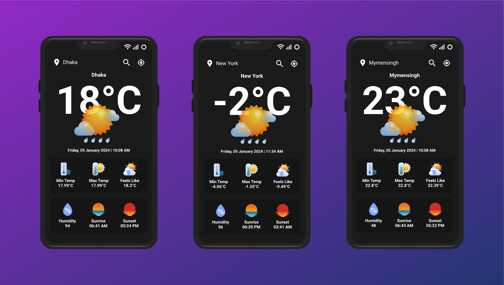

## Android Weather App
- **[Ahnaf Shahrear Khan](https://github.com/ahnafshahrear)**
- **Computer Science & Engineering, University of Rajshahi**
- **This was a project of Software Development Lab 3, Computer Science & Engineering, University of Rajshahi**

  
### Tools
- **[Android Studio](https://developer.android.com/studio)**
- **[Flutter](https://flutter.dev/)**
- **[Open Weather API](https://flutter.dev/](https://openweathermap.org/api)**

### App Preview
